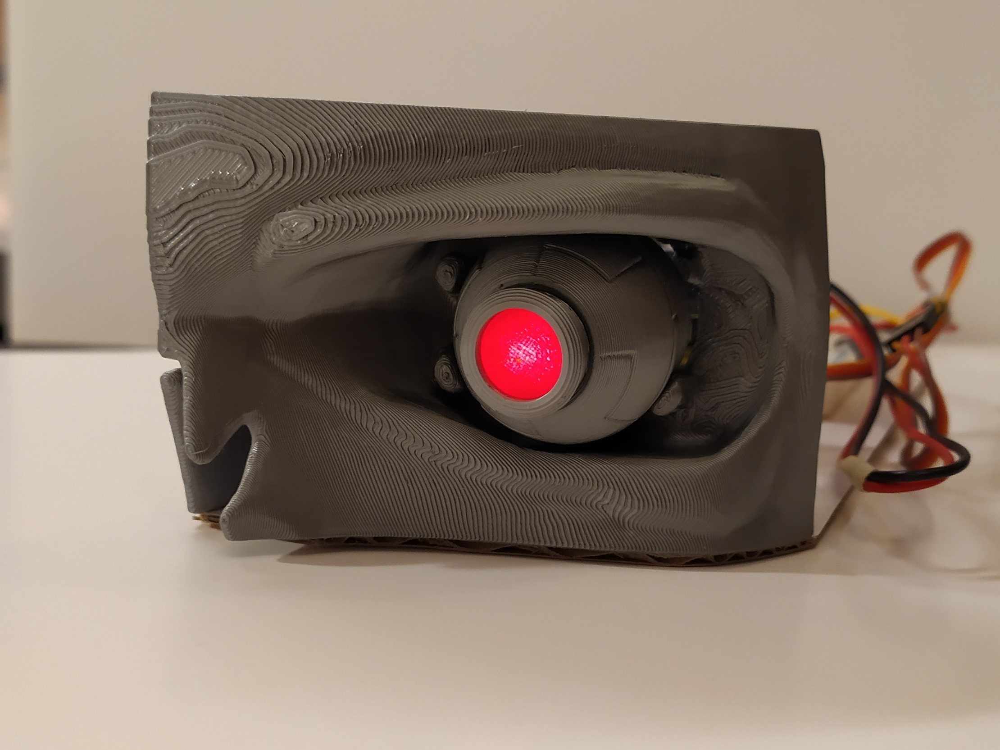

# Terminator Clock (T-800 Eye Mechanism Prototype)

An ESP8266-controlled NTP-based alarm clock that looks like a T-800 eye mechanism prototype with a React configuration UI.

> I decided to stop working on this project, so don't expect any update here. In its current state this is more like a proof of concept together with my [Arduino MP3 Alarm Clock](https://github.com/balassy/arduino-mp3-alarm-clock) project. Check the `_Photos` folder to see the current status of this project.

## Yet Another T-800 Eye Model?

I created this project, because:
- I wanted moving T-800 eye mechanism with a working LED in it.
- I wanted to control it with a microcontroller to add additional features (sounds, sensors etc.).
- I wanted to experiment with ball joints created by FDM printers.
- I wanted to build a web UI for ESP8266 with React.

Lessons learned:
- Creating ball joints on FDM printers is possible, but needs sanding and experimenting to get the perfect snap fit.
- Servos do a homing when they powered up. This means the SG90 quickly jumps back to its home position then the device is turned on. This quick jump can shake the snap fit joints apart.
- The [esp8266-react](https://github.com/rjwats/esp8266-react) is a good starting point, though the build task is quite slow.
- When you import an existing model into Fusion 360 take your time to aligne it perfectly with your existing reference faces and axes (e.g. origin). A fraction of a millimeter error can be magnified in a few centimeters apart and cause misaligned constraints or break the symmetry.

## Hardware

Parts:
- 1× Wemos D1 Mini
- 2× SG90 servo motor
- 1× 5mm red LED
- 1× 100Ω resistor

Wiring:
1. Connect the LED to 3.3V and GND.
2. Connect the vertical servo to 5V, GND and D3.
3. Connect the horizontal servo to 5V, GNd and D0.

## Software

This project relies on [Platform IO](https://platformio.org/) so first you have to install that.

The web interface is built with [esp8266-react](https://github.com/rjwats/esp8266-react) the README of that project contains a lot of details about how this project is structured.

The Git history of this repository shows how I rebranded it to T-800 style.

## 3D Printed Parts

You can find the 3D printable STL files in the `_3D-Print` folder.

I designed the model with Fusion 360 and also shared the source files in case you want to further enhance them.

The eyeball, iris and pupil is based on [Metalnat's Terminator Eye model](https://www.thingiverse.com/thing:984200) on Thingiverse.

## About the author

This project was created by [György Balássy](https://linkedin.com/in/balassy).
